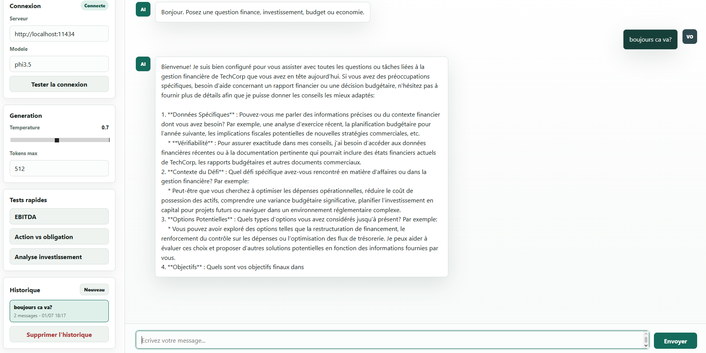

# Interface DEV WEB - TechCorp Chat

Interface web statique pour discuter avec le modele Phi-3.5-Financial via Ollama.

## Lancement

Depuis ce dossier :

```powershell
.\start.ps1
```

Puis ouvrir :

```text
http://localhost:5173
```

## Configuration attendue

- Serveur Ollama : `http://localhost:11434`
- Modele par defaut : `phi3.5`
- Endpoint utilise : `POST /api/chat`
- Verification de connexion : `GET /api/tags`

Le nom du modele et l'URL du serveur peuvent etre modifies directement dans l'interface si l'equipe INFRA utilise un autre nom ou une autre machine.

## Preuve de fonctionnement

Connexion etablie avec le serveur Ollama (`localhost:11434`, modele `phi3.5`) et echange en temps reel :



## Fonctionnalites livrees

- Chat temps reel avec streaming des reponses Ollama.
- Historique affiche dans le chat et sauvegarde dans le navigateur.
- Acces aux anciennes discussions depuis la barre laterale.
- Etat de connexion visible.
- Bouton de test serveur.
- Reglages temperature et nombre maximal de tokens.
- Prompts rapides pour la demonstration finance.
- Interface responsive desktop/mobile.
